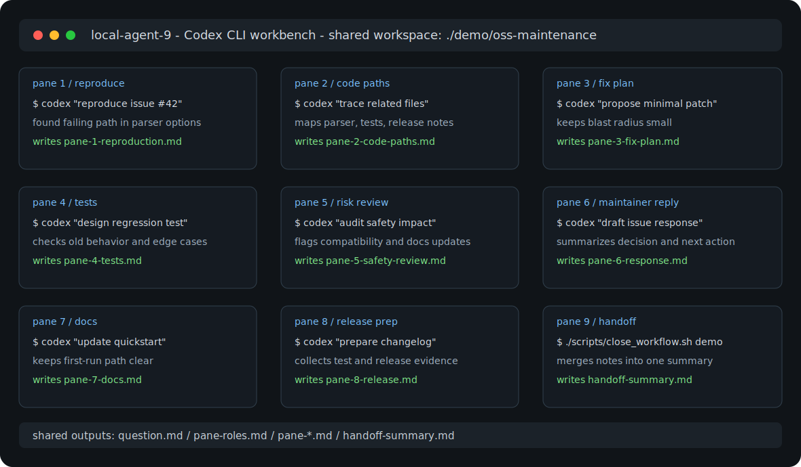

# Local Agent Workbench

[](https://github.com/goonobu-dot/local-agent-workbench/actions/workflows/ci.yml)
[](https://github.com/goonobu-dot/local-agent-workbench/releases)
[](LICENSE)

A macOS/tmux workbench for running multiple local AI-agent CLI sessions in one window.

The first supported target is Codex CLI. The goal is simple: open 4, 6, or 9 agent panes against one shared workspace so you can collect ideas, compare approaches, run parallel research, and keep the resulting files in one place.



## Install In 60 Seconds

```bash
curl -fsSL https://raw.githubusercontent.com/goonobu-dot/local-agent-workbench/main/scripts/install.sh | bash
cd "$HOME/AgentWorkbench/local-agent-workbench"
make first-run
```

Full setup notes are in [docs/install.md](docs/install.md).

## Try Without Installing

```bash
git clone https://github.com/goonobu-dot/local-agent-workbench.git
cd local-agent-workbench
./scripts/doctor.sh
make demo
```

## Demo Preview

The fastest no-risk preview is `make first-run`: it checks your machine, creates
a temporary demo workflow, closes it into a handoff summary, and lists available
workflow templates.

## Who This Is For

- OSS maintainers who need faster issue triage, pull request review, release preparation, or security screening.
- Developers who want several independent Codex CLI angles on one local folder without building a hosted system.
- Researchers and builders who want reusable markdown outputs instead of scattered chat transcripts.

## What You Get In 5 Minutes

- a local 4, 6, or 9 pane tmux workbench
- workflow templates for issue triage, PR review, release prep, and feature discovery
- one shared folder containing role prompts, pane notes, and a final handoff summary
- a doctor report and quality gates so setup problems are easier to diagnose

## Example Outputs

- [issue triage result](examples/issue-triage-demo/final-triage.md)
- [pull request review verdict](examples/pr-review-demo/final-review.md)
- [release checklist](examples/release-prep-demo/release-checklist.md)
- [feature decision memo](examples/feature-discovery-demo/decision-memo.md)
- [security triage](examples/security-triage-demo/security-triage.md)
- [documentation improvement plan](examples/docs-improvement-demo/docs-plan.md)
- [dependency update review](examples/dependency-update-demo/update-review.md)

## Share A Usage Report

If the workbench helps you make a real maintenance decision, open a
[usage report](.github/ISSUE_TEMPLATE/usage_report.yml). Short reports are
useful: the workflow used, what it produced, and where the setup was confusing.

## Why This Exists

AI agents are useful, but one chat window is often too narrow for exploration. This workbench gives you a repeatable local setup for:

- parallel research and idea generation
- comparing multiple solution paths side by side
- keeping all panes pointed at the same project folder
- switching between 4, 6, and 9 panes without rebuilding your terminal layout
- launching the setup as a small macOS app shortcut

## Requirements

- macOS
- `tmux`
- Codex CLI available on your `PATH`
- Python 3 and Pillow only if you regenerate the icon

Install tmux with Homebrew:

```bash
brew install tmux
```

## Quick Start

One-command install:

```bash
curl -fsSL https://raw.githubusercontent.com/goonobu-dot/local-agent-workbench/main/scripts/install.sh | bash
```

Then launch:

```bash
cd "$HOME/AgentWorkbench/local-agent-workbench"
make demo
./scripts/launch_codex_tmux.sh
```

Check your local setup without starting a workbench session:

```bash
./scripts/doctor.sh
```

Run the local validation suite:

```bash
make test
```

Create a reusable maintainer workflow folder before launching panes:

```bash
./scripts/new_workflow.sh issue-triage
AGENT_WORKBENCH_IDEA_DIR="$HOME/AgentWorkbench/Idea" ./scripts/launch_codex_tmux.sh
```

Start directly from a public GitHub issue or pull request URL:

```bash
./scripts/create_workflow_from_url.sh https://github.com/owner/repo/issues/123
./scripts/create_workflow_from_url.sh https://github.com/owner/repo/pull/123
```

Launch with role-specific prompts generated from `pane-roles.md`:

```bash
AGENT_WORKBENCH_IDEA_DIR="$HOME/AgentWorkbench/Idea" \
AGENT_WORKBENCH_USE_ROLE_PROMPTS=1 \
./scripts/launch_codex_tmux.sh
```

After the panes write their notes, create a handoff summary:

```bash
./scripts/close_workflow.sh "$HOME/AgentWorkbench/Idea"
```

Export a workflow folder for sharing:

```bash
./scripts/export_workflow.sh "$HOME/AgentWorkbench/Idea"
```

Import a shared workflow archive:

```bash
./scripts/import_workflow.sh ./Idea-workflow-export.tar.gz
```

All panes use one shared idea folder by default:

```bash
~/AgentWorkbench/Idea
```

Manual clone instead of the installer:

```bash
mkdir -p "$HOME/AgentWorkbench"
git clone https://github.com/goonobu-dot/local-agent-workbench.git "$HOME/AgentWorkbench/local-agent-workbench"
cd "$HOME/AgentWorkbench/local-agent-workbench"
./scripts/doctor.sh
```

## Controls

- `control-b z`: zoom or unzoom the active pane
- `control-b 4`: switch to 4 panes
- `control-b 6`: switch to 6 panes
- `control-b 9`: switch back to 9 panes

## Configuration

The public configuration names are `AGENT_WORKBENCH_*`. Older `CODEX_WORKBENCH_*` names are still accepted as compatibility aliases.

```bash
AGENT_WORKBENCH_PANE_COUNT=4 ./scripts/launch_codex_tmux.sh
AGENT_WORKBENCH_BASE="$HOME/AgentWorkbench" ./scripts/launch_codex_tmux.sh
AGENT_WORKBENCH_IDEA_DIR="$HOME/AgentWorkbench/Research" ./scripts/launch_codex_tmux.sh
AGENT_WORKBENCH_MODEL="gpt-5.4-mini" ./scripts/launch_codex_tmux.sh
AGENT_WORKBENCH_AUTO_SUBMIT=0 ./scripts/launch_codex_tmux.sh
```

Defaults:

| Setting | Default |
| --- | --- |
| `AGENT_WORKBENCH_PANE_COUNT` | `9` |
| `AGENT_WORKBENCH_SESSION` | `local-agent-9` |
| `AGENT_WORKBENCH_BASE` | `~/AgentWorkbench` |
| `AGENT_WORKBENCH_IDEA_DIR` | `~/AgentWorkbench/Idea` |
| `AGENT_WORKBENCH_MODEL` | `gpt-5.4-mini` |
| `AGENT_WORKBENCH_AUTO_SUBMIT` | `1` |

## Workflow Recipes

See [docs/workflows.md](docs/workflows.md) for practical patterns:

- parallel research
- competing hypotheses
- feature discovery
- small task mode
- public-output safety checks

See also:

- [docs/oss-maintainer-use-cases.md](docs/oss-maintainer-use-cases.md)
- [docs/showcase.md](docs/showcase.md)
- [docs/why.md](docs/why.md)
- [docs/one-minute-demo.md](docs/one-minute-demo.md)
- [docs/evaluation-guide.md](docs/evaluation-guide.md)
- [docs/install.md](docs/install.md)
- [docs/commands.md](docs/commands.md)
- [docs/architecture.md](docs/architecture.md)
- [docs/quality-gates.md](docs/quality-gates.md)
- [docs/workflow-templates.md](docs/workflow-templates.md)
- [docs/workflow-sharing.md](docs/workflow-sharing.md)
- [docs/troubleshooting.md](docs/troubleshooting.md)
- [docs/faq.md](docs/faq.md)
- [SUPPORT.md](SUPPORT.md)
- [docs/publication-checklist.md](docs/publication-checklist.md)
- [docs/openai-codex-for-oss.md](docs/openai-codex-for-oss.md)
- [docs/adoption-plan.md](docs/adoption-plan.md)

Example:

- [examples/issue-triage-demo](examples/issue-triage-demo)
- [examples/pr-review-demo](examples/pr-review-demo)
- [examples/release-prep-demo](examples/release-prep-demo)
- [examples/feature-discovery-demo](examples/feature-discovery-demo)
- [examples/security-triage-demo](examples/security-triage-demo)
- [examples/docs-improvement-demo](examples/docs-improvement-demo)
- [examples/dependency-update-demo](examples/dependency-update-demo)

Project operations:

- [ROADMAP.md](ROADMAP.md)
- [CHANGELOG.md](CHANGELOG.md)
- [SECURITY.md](SECURITY.md)

If you try it on a real or fictional maintainer task, share the result with the
[usage report issue template](.github/ISSUE_TEMPLATE/usage_report.yml). Reports
about confusing setup steps are as useful as reports about successful workflows.

## Build The macOS App

```bash
./scripts/build_codex_app.sh
open "$HOME/Applications/Local Agent Workbench.app"
```

The generated app opens Terminal and launches the tmux workbench. The checked-in AppleScript does not contain a personal path. By default, it expects this repository at:

```bash
~/AgentWorkbench/local-agent-workbench
```

## Safety Notes

This repository intentionally does not include local logs, `.env` files, prompt histories, Obsidian vaults, or generated agent output.

Before publishing your own fork, run:

```bash
make test
```

## Project Status

This is an early public release extracted from a real local workflow. The current implementation focuses on Codex CLI because that is the tested path. The naming is intentionally broader so future adapters can support other local agent CLIs without changing the project identity.
